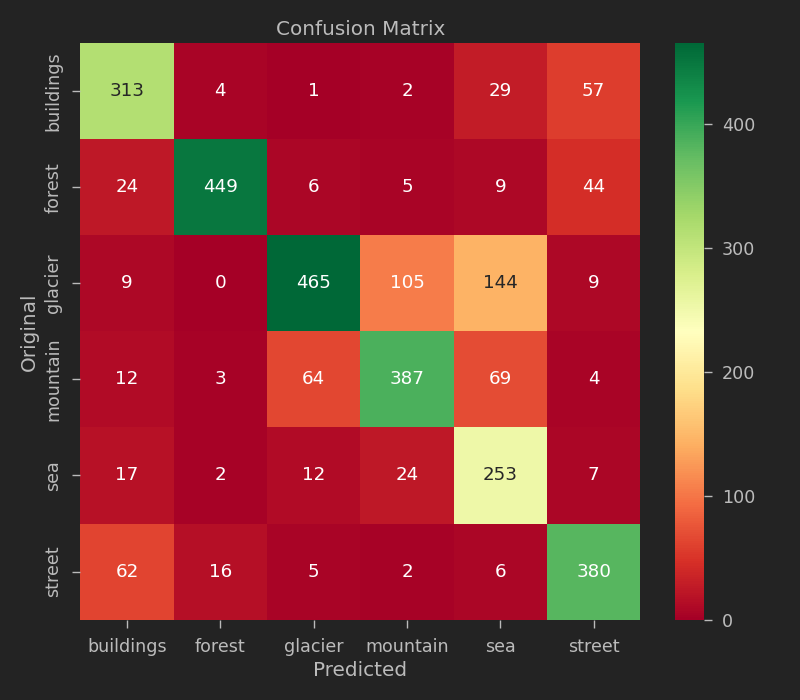
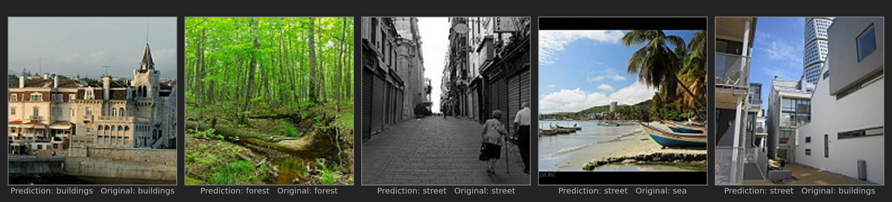

# Explainable AI: Scene Classification and GradCam Visualization

This project involves training a deep learning model to predict the type of scenery in images. In addition, we are going to use a technique known as Grad-Cam to help explain how AI models think. This could be practically used for detecting the type of scenery from the satellite images.

## Dataset Description

## Model Architecture - ResNet (Deep CNN with Residual Blocks)

## Model Performance

## Testing input/output

<!--TODO: Live link-->

<!--TODO: Screenshot of interface-->

## Reference

Ahmed, R. (n.d.). Explainable AI: Scene Classification and GradCam Visualization [MOOC]. Coursera. https://www.coursera.org/projects/scene-classification-gradcam

Duong, B. T. (2021). Explainable AI: Scene classification and Grad-CAM visualization [Source code]. GitHub. https://github.com/baotramduong/Explainable-AI-Scene-Classification-and-GradCam-Visualization
