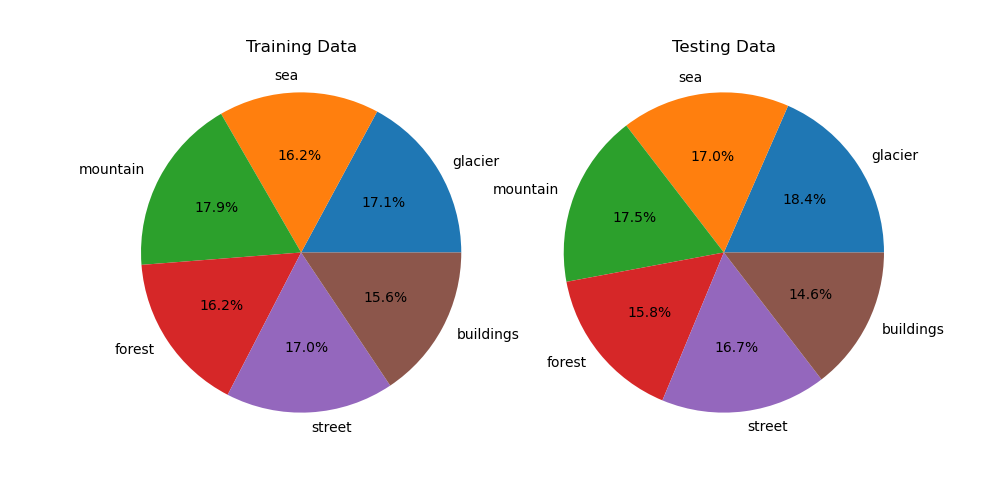
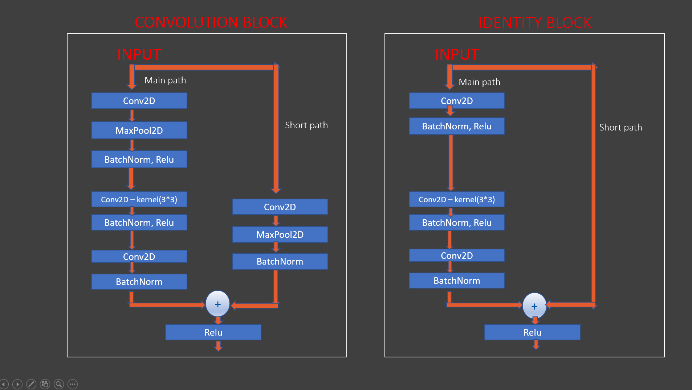
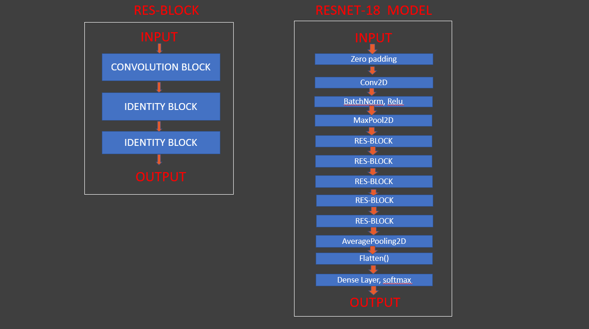
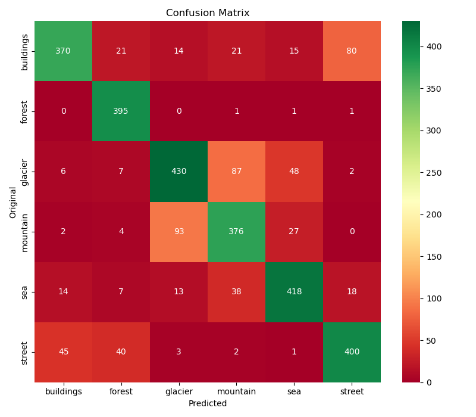
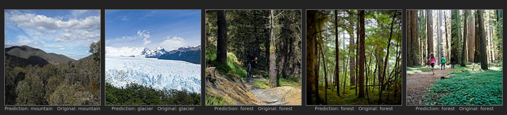
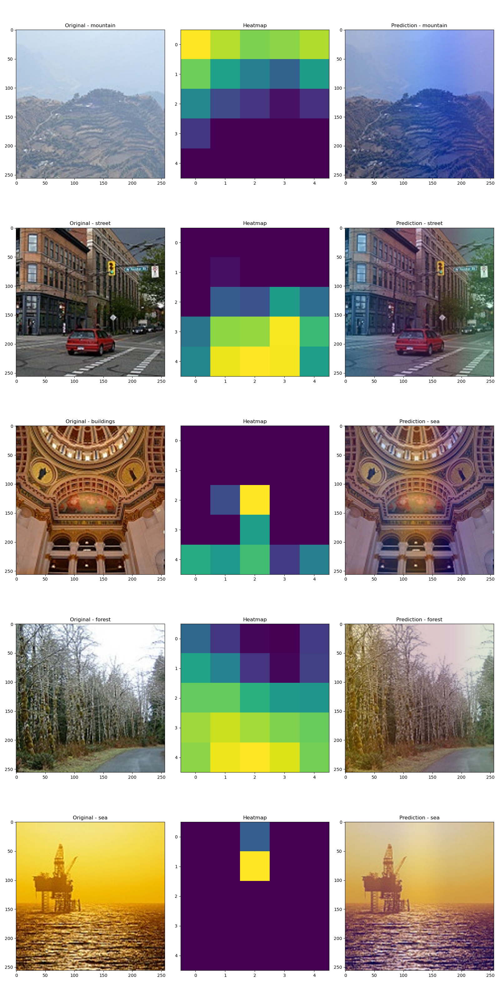

# Explainable AI: Scene Classification and GradCam Visualization

This project involves training a deep learning model to predict the type of scenery in images. In addition, we are going to use a technique known as Grad-Cam to help explain how AI models think. This could be practically used for detecting the type of scenery from the satellite images.

## Dataset Description

## Model Architecture - ResNet (Deep CNN with Residual Blocks)

*(Refer to [this image](figures/resnet18_model.png) to see model implementation)*

## Model Performance

## Testing input/output

## Grad-CAM Visualization

## References

Ahmed, R. (n.d.). Explainable AI: Scene Classification and GradCam Visualization [MOOC]. Coursera. https://www.coursera.org/projects/scene-classification-gradcam

Duong, B. T. (2021). Explainable AI: Scene classification and Grad-CAM visualization [Source code]. GitHub. https://github.com/baotramduong/Explainable-AI-Scene-Classification-and-GradCam-Visualization

TensorFlow. (n.d.). TensorFlow documentation. https://www.tensorflow.org/

Keras. (n.d.). Keras documentation. https://keras.io/

Prefix.dev. (n.d.). Pixi documentation. https://pixi.prefix.dev/latest/
